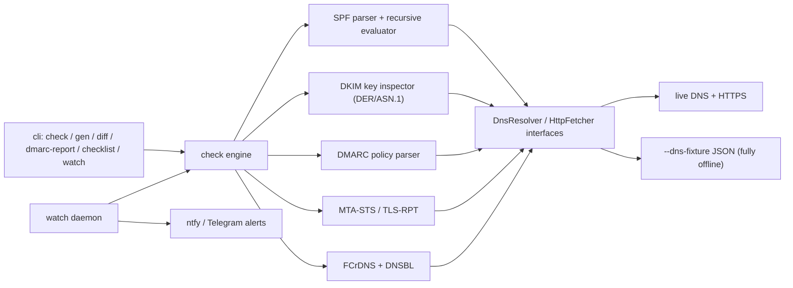

# postdoctor

[English](README.md) | [中文](README.zh.md) | [日本語](README.ja.md)

[](LICENSE)  [](package.json)

**セルフホスト（self-hosted）メール向けのオープンソース到達性診断ツール。Gmail に拒否される原因をコマンド 1 つで特定できます。**


```bash
git clone https://github.com/JaydenCJ/postdoctor.git && cd postdoctor && npm install && npm run build
```

## なぜ postdoctor なのか

2025 年 11 月以降、Gmail は要件を満たさないメールを SMTP レベルで恒久的に拒否するようになり、2025 年 5 月以降、Microsoft は未認証のバルク送信者に `550 5.7.515` を返すようになりました。「迷惑メールに入るだけで、いつか誰かが気づく」という時代は終わっています。メールサーバーの構築自体は Mailcow や Stalwart で解決済みの問題ですが、メールを**受け取ってもらう**ことは別問題で、その 9 割は DNS 設定の正しさで決まります。ところがこの領域のツールはクローズドな SaaS 型チェッカーばかりで、テストメール 1 通を一度採点して終わりです。postdoctor は CLI とフォアグラウンド daemon の両形態で動き、SPF・DKIM・DMARC・MTA-STS/TLS-RPT・forward-confirmed rDNS・DNS ブロックリストを診断し、不足している DNS レコードを生成し、DMARC 集計レポートを平易な言葉に翻訳し、継続監視によって利用者より先に障害へ気づけるようにします。

|  | postdoctor | mail-tester | Mailcow |
|---|---|---|---|
| ソースモデル | オープンソース（MIT） | クローズド SaaS | オープンソース（GPL-3.0） |
| 対象範囲 | ドメイン全体の DNS/認証診断（SPF、DKIM、DMARC、MTA-STS、rDNS、DNSBL） | テストメール 1 通の採点 | メールサーバースイート（DKIM 鍵管理のみ） |
| DNS レコード生成 + 差分検知 | あり（`gen`、`diff`） | なし | DKIM 鍵のみ |
| DMARC 集計レポートの翻訳 | あり（XML と .xml.gz） | なし | なし |
| 継続監視 + アラート | あり（`watch`、ntfy/Telegram） | なし（単発） | なし |
| オフライン / CI 実行 | あり（`--dns-fixture`） | なし | なし |

## 特徴

- **コマンド 1 つで全体像** — `check` は SPF、DKIM、DMARC、MTA-STS/TLS-RPT、forward-confirmed rDNS、4 つの DNS ブロックリストを一度に診断します。指摘ごとに修正ヒントが付き、`--json` 出力にも対応し、拒否につながる問題があれば終了コード 1 を返します。
- **本物の SPF 評価** — RFC 7208 に準拠したパーサーと再帰評価器を実装しています。`include`/`redirect` チェーンをたどり、DNS lookup 10 回制限を数え、include ループも検出します。TXT レコードへの正規表現ではありません。
- **DMARC レポートを平易な言葉に** — `dmarc-report` は集計 XML（生ファイルまたは gzip）を送信元ごとの結論に翻訳します。どの IP が正しく認証され、どれが転送経路らしく、どれがなりすましらしいかが分かります。
- **修正はコピー & ペーストで** — `gen` はそのまま貼れる zone-file 形式のレコード（SPF、DMARC、DKIM、MTA-STS、TLS-RPT）と MTA-STS ポリシーファイルを出力します。`diff` はレコードをベースラインとして保存し、以後の変化を検出します。
- **利用者が気づく前にアラート** — `watch` はフォアグラウンドで（cron/compose と相性よく）定期的に診断を再実行し、新しい失敗・回復・DNS の変化を ntfy または Telegram に通知します。
- **受信側ごとのチェックリスト** — `checklist` は診断結果を Gmail、Outlook、Yahoo が公開する送信者要件に対応付け、どの規則に抵触しているかを明示します。
- **足元は堅実** — ランタイム依存は 2 つだけ（`commander`、`fast-xml-parser`）です。DNS、HTTP、gzip、さらに DKIM 鍵長を測る DER/ASN.1 解析まで Node 標準ライブラリと自前実装で賄い、`--dns-fixture` によりツール全体を完全オフラインで実行できます。

## クイックスタート

1. インストール:

```bash
git clone https://github.com/JaydenCJ/postdoctor.git && cd postdoctor && npm install && npm run build
```

2. ドメインを診断します（実在するドメインならどれでも動きます。`--selector` には自分の DKIM selector を指定します）:

```bash
node dist/cli.js check migadu.com --selector key1
```

出力（実際の実行結果、途中省略あり）:

```text
Deliverability report for migadu.com
checked at 2026-07-08T06:01:44.020Z

■ SPF
  PASS  SPF record found: v=spf1 include:spf.migadu.com -all
  PASS  DNS lookups within limit (4/10)
  PASS  record ends with "-all" (strict)

■ DKIM
  PASS  selector "key1": valid RSA-2048 key

■ DMARC
  PASS  policy is p=quarantine
...
■ Reverse DNS
  PASS  51.38.57.138 → mizu0.migadu.com → 51.38.57.138 (forward-confirmed rDNS)
  FAIL  2001:41d0:700:19b4::1 has no PTR record; Gmail rejects mail from IPs without valid rDNS
        ↳ Ask your hosting provider to set the PTR to your mail hostname.
...
■ Blocklists (DNSBL)
  PASS  51.38.57.138 is not listed on 4 checked blocklists
...
Overall: FAIL  (3 fail, 0 warn, 12 pass)
```

3. 見つかった問題を直すための DNS レコードを生成します:

```bash
node dist/cli.js gen example.net --ip 203.0.113.25 --policy quarantine --rua postmaster@example.net
```

出力（途中省略あり）:

```text
; SPF: which servers may send mail as this domain
example.net. 3600 IN TXT "v=spf1 ip4:203.0.113.25 -all"

; DMARC: enforce quarantine on failing mail
_dmarc.example.net. 3600 IN TXT "v=DMARC1; p=quarantine; rua=mailto:postmaster@example.net; adkim=r; aspf=r"
...
```

4. DMARC 集計レポートを平易な言葉に翻訳します:

```bash
node dist/cli.js dmarc-report tests/fixtures/google-aggregate.xml
```

出力（途中省略あり）:

```text
DMARC aggregate report from google.com
domain example.org · 2025-07-05 → 2025-07-05 · policy p=none

42/52 messages passed DMARC (80.8%); 10 failed.

Per sending source:
  ✔ 192.0.2.10 — 42 msg(s), 0 failed
      authenticating correctly
  ✘ 198.51.100.77 — 7 msg(s), 7 failed
      all mail failed DMARC (delivered only because policy is none) — fix SPF/DKIM for this source or it is a spoofer
...
```

5. 継続監視して、新しい失敗や DNS の変化をアラートで受け取ります（`--max-cycles` を外すと常駐実行になります。`--ntfy <url>` または `--telegram-token`/`--telegram-chat` でプッシュ通知を有効化できます）:

```bash
node dist/cli.js watch migadu.com --selector key1 --interval 3600 --max-cycles 1 --no-dnsbl
```

出力:

```text
[watch] monitoring migadu.com every 3600s for 1 cycle(s) — no alert channel configured (logging only)
[watch] cycle 1 at 2026-07-08T06:04:19.885Z: overall=fail fails=3 alerts=1
```

## アーキテクチャ



## ロードマップ

- [x] v0.1.0 — 実際に動く 6 コマンド（`check`、`gen`、`diff`、`dmarc-report`、`checklist`、`watch`）と 122 件のオフラインテスト
- [ ] IPv6 の DNSBL 照会（nibble 形式クエリ）
- [ ] `.zip` 圧縮された DMARC 集計レポート添付への対応
- [ ] Mailcow / Stalwart との連携インテグレーション
- [ ] Google Postmaster Tools と Microsoft SNDS のレピュテーションデータ取り込み

全体は [open issues](https://github.com/JaydenCJ/postdoctor/issues) を参照してください。

## コントリビューション

コントリビューションを歓迎します。変更したい内容を [issue](https://github.com/JaydenCJ/postdoctor/issues) でお気軽にご相談ください。

## ライセンス

[MIT](LICENSE)
