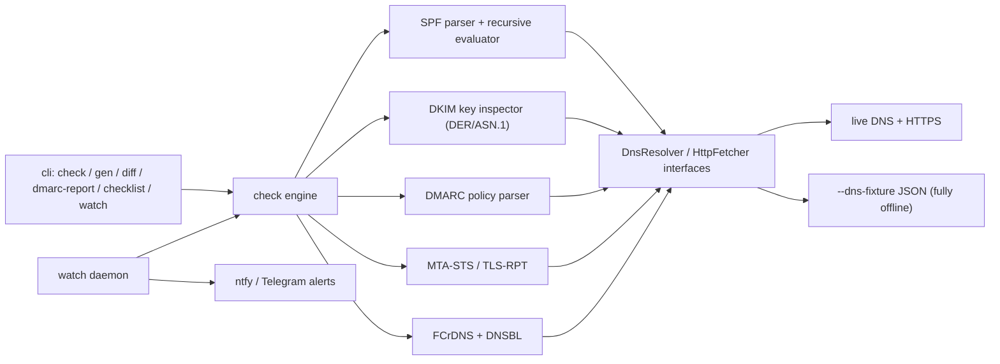

# postdoctor

[English](README.md) | [中文](README.zh.md) | [日本語](README.ja.md)

[](LICENSE)  [](package.json)

**An open-source deliverability doctor for self-hosted email: one command tells you why Gmail rejects your mail.**


```bash
git clone https://github.com/JaydenCJ/postdoctor.git && cd postdoctor && npm install && npm run build
```

## Why postdoctor?

Since November 2025 Gmail hard-rejects non-compliant mail at the SMTP level, and since May 2025 Microsoft answers unauthenticated bulk senders with `550 5.7.515` — the era of "it lands in spam, eventually someone notices" is over. Installing a mail server is a solved problem (Mailcow, Stalwart); getting your mail *accepted* is 90% DNS hygiene, and the tools for that are closed-source SaaS checkers that score one message once and walk away. postdoctor is a CLI and foreground daemon that audits SPF, DKIM, DMARC, MTA-STS/TLS-RPT, forward-confirmed rDNS and DNS blocklists, generates the records you are missing, translates DMARC aggregate reports into plain language, and keeps monitoring so you hear about breakage before your users do.

|  | postdoctor | mail-tester | Mailcow |
|---|---|---|---|
| Source model | open source (MIT) | closed SaaS | open source (GPL-3.0) |
| Scope | domain-wide DNS/auth audit (SPF, DKIM, DMARC, MTA-STS, rDNS, DNSBL) | scores one test message | mail server suite; DKIM key management only |
| DNS record generation + drift diff | yes (`gen`, `diff`) | no | DKIM key only |
| DMARC aggregate report translation | yes (XML and .xml.gz) | no | no |
| Continuous monitoring + alerts | yes (`watch`, ntfy/Telegram) | no (one-shot) | no |
| Runs offline / in CI | yes (`--dns-fixture`) | no | no |

## Features

- **One command, whole picture** — `check` covers SPF, DKIM, DMARC, MTA-STS/TLS-RPT, forward-confirmed rDNS and 4 DNS blocklists in a single run, with per-finding fix hints, `--json` output, and exit code 1 whenever something would get you rejected.
- **Real SPF evaluation** — an RFC 7208 parser and recursive evaluator that walks `include`/`redirect` chains, counts the 10-DNS-lookup limit, and detects include loops — not a regex over your TXT record.
- **DMARC reports in plain language** — `dmarc-report` turns aggregate XML (plain or gzip) into per-source verdicts: which IPs authenticate correctly, which look like forwarders, which look like spoofers.
- **Copy-paste fixes** — `gen` emits ready-to-paste zone-file records (SPF, DMARC, DKIM, MTA-STS, TLS-RPT) plus the MTA-STS policy file; `diff` snapshots your records as a baseline and flags any drift.
- **Alerts before your users notice** — `watch` re-runs the audit on an interval in the foreground (cron/compose friendly) and pushes new failures, recoveries and DNS drift to ntfy or Telegram.
- **Receiver-specific checklists** — `checklist` maps your audit results onto the published sender requirements of Gmail, Outlook and Yahoo, so you know exactly which rule you are tripping.
- **Nothing exotic underneath** — two runtime dependencies (`commander`, `fast-xml-parser`); DNS, HTTP, gzip and even the DER/ASN.1 parsing that measures your DKIM key size are Node standard library or hand-written, and `--dns-fixture` runs the whole tool offline.

## Quickstart

1. Install:

```bash
git clone https://github.com/JaydenCJ/postdoctor.git && cd postdoctor && npm install && npm run build
```

2. Check a domain (any real domain works; `--selector` is your DKIM selector):

```bash
node dist/cli.js check migadu.com --selector key1
```

Output (real run, truncated):

```text
Deliverability report for migadu.com
checked at 2026-07-08T06:01:44.020Z

■ SPF
  PASS  SPF record found: v=spf1 include:spf.migadu.com -all
  PASS  DNS lookups within limit (4/10)
  PASS  record ends with "-all" (strict)

■ DKIM
  PASS  selector "key1": valid RSA-2048 key

■ DMARC
  PASS  policy is p=quarantine
...
■ Reverse DNS
  PASS  51.38.57.138 → mizu0.migadu.com → 51.38.57.138 (forward-confirmed rDNS)
  FAIL  2001:41d0:700:19b4::1 has no PTR record; Gmail rejects mail from IPs without valid rDNS
        ↳ Ask your hosting provider to set the PTR to your mail hostname.
...
■ Blocklists (DNSBL)
  PASS  51.38.57.138 is not listed on 4 checked blocklists
...
Overall: FAIL  (3 fail, 0 warn, 12 pass)
```

3. Generate the records to fix what it found:

```bash
node dist/cli.js gen example.net --ip 203.0.113.25 --policy quarantine --rua postmaster@example.net
```

Output (truncated):

```text
; SPF: which servers may send mail as this domain
example.net. 3600 IN TXT "v=spf1 ip4:203.0.113.25 -all"

; DMARC: enforce quarantine on failing mail
_dmarc.example.net. 3600 IN TXT "v=DMARC1; p=quarantine; rua=mailto:postmaster@example.net; adkim=r; aspf=r"
...
```

4. Translate a DMARC aggregate report into plain language:

```bash
node dist/cli.js dmarc-report tests/fixtures/google-aggregate.xml
```

Output (truncated):

```text
DMARC aggregate report from google.com
domain example.org · 2025-07-05 → 2025-07-05 · policy p=none

42/52 messages passed DMARC (80.8%); 10 failed.

Per sending source:
  ✔ 192.0.2.10 — 42 msg(s), 0 failed
      authenticating correctly
  ✘ 198.51.100.77 — 7 msg(s), 7 failed
      all mail failed DMARC (delivered only because policy is none) — fix SPF/DKIM for this source or it is a spoofer
...
```

5. Keep watching and get alerted on new failures or DNS drift (drop `--max-cycles` to run forever; add `--ntfy <url>` or `--telegram-token`/`--telegram-chat` for push alerts):

```bash
node dist/cli.js watch migadu.com --selector key1 --interval 3600 --max-cycles 1 --no-dnsbl
```

Output:

```text
[watch] monitoring migadu.com every 3600s for 1 cycle(s) — no alert channel configured (logging only)
[watch] cycle 1 at 2026-07-08T06:04:19.885Z: overall=fail fails=3 alerts=1
```

## Architecture



## Roadmap

- [x] v0.1.0 — six working commands (`check`, `gen`, `diff`, `dmarc-report`, `checklist`, `watch`), 122 offline tests
- [ ] IPv6 DNSBL lookups (nibble-format queries)
- [ ] `.zip`-compressed DMARC aggregate report attachments
- [ ] Mailcow / Stalwart companion integration
- [ ] Import reputation data from Google Postmaster Tools and Microsoft SNDS

See the [open issues](https://github.com/JaydenCJ/postdoctor/issues) for the full list.

## Contributing

Contributions are welcome — open an [issue](https://github.com/JaydenCJ/postdoctor/issues) to discuss what you would like to change.

## License

[MIT](LICENSE)
