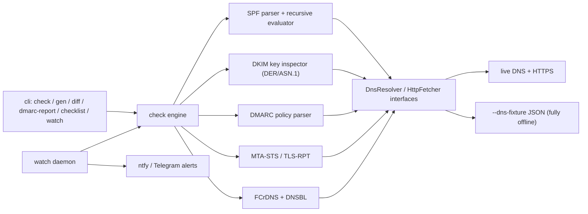

# postdoctor

[English](README.md) | [中文](README.zh.md) | [日本語](README.ja.md)

[](LICENSE)  [](package.json)

**面向自托管（self-hosted）邮件的开源送达性体检工具：一条命令告诉你 Gmail 为什么拒收你的邮件。**


```bash
git clone https://github.com/JaydenCJ/postdoctor.git && cd postdoctor && npm install && npm run build
```

## 为什么是 postdoctor？

自 2025 年 11 月起，Gmail 对不合规邮件直接在 SMTP 层永久拒绝；自 2025 年 5 月起，Microsoft 对未认证的批量发件人回以 `550 5.7.515`——"先进垃圾箱、总会有人发现"的时代结束了。装一台邮件服务器早已是被解决的问题（Mailcow、Stalwart），真正的难题是让邮件**被收下**：这件事 90% 靠 DNS 配置的正确性，而现有工具只有闭源 SaaS 检测器，给一封测试邮件打一次分就结束。postdoctor 是一个 CLI + 前台 daemon：体检 SPF、DKIM、DMARC、MTA-STS/TLS-RPT、正向确认 rDNS 与 DNS 黑名单，生成你缺失的 DNS 记录，把 DMARC 聚合报告翻译成人话，并持续监控——让你在用户抱怨之前先知道哪里坏了。

|  | postdoctor | mail-tester | Mailcow |
|---|---|---|---|
| 源码模式 | 开源（MIT） | 闭源 SaaS | 开源（GPL-3.0） |
| 覆盖范围 | 域名级 DNS/认证体检（SPF、DKIM、DMARC、MTA-STS、rDNS、DNSBL） | 对一封测试邮件打分 | 邮件服务器套件；仅 DKIM 密钥管理 |
| DNS 记录生成 + 漂移 diff | 有（`gen`、`diff`） | 无 | 仅 DKIM 密钥 |
| DMARC 聚合报告翻译 | 有（XML 与 .xml.gz） | 无 | 无 |
| 持续监控 + 告警 | 有（`watch`，ntfy/Telegram） | 无（单次检测） | 无 |
| 离线 / CI 可跑 | 有（`--dns-fixture`） | 无 | 无 |

## 特性

- **一条命令看全貌** —— `check` 单次运行覆盖 SPF、DKIM、DMARC、MTA-STS/TLS-RPT、正向确认 rDNS 与 4 个 DNS 黑名单，每条结论附修复提示，支持 `--json` 输出；只要有会导致拒收的问题，退出码即为 1。
- **真正的 SPF 求值** —— 按 RFC 7208 实现的解析器 + 递归评估器：沿 `include`/`redirect` 链展开、统计 10 次 DNS lookup 上限、检测 include 环——不是对 TXT 记录跑一遍正则。
- **DMARC 报告说人话** —— `dmarc-report` 把聚合 XML（裸文件或 gzip）翻译成按来源的结论：哪些 IP 认证正常、哪些像转发路径、哪些像伪造者。
- **修复即复制粘贴** —— `gen` 输出可直接粘贴的 zone-file 记录（SPF、DMARC、DKIM、MTA-STS、TLS-RPT）与 MTA-STS policy 文件；`diff` 把记录快照成 baseline，之后任何漂移都会被标出。
- **在用户发现之前告警** —— `watch` 以前台方式（对 cron/compose 友好）按周期重跑体检，新增失败、失败恢复与 DNS 漂移都会推送到 ntfy 或 Telegram。
- **按收件方的合规清单** —— `checklist` 把体检结果映射到 Gmail、Outlook、Yahoo 各自公开的发件人要求上，让你确切知道踩了哪一条。
- **底层毫不花哨** —— 运行时依赖只有 2 个（`commander`、`fast-xml-parser`）；DNS、HTTP、gzip、乃至测量 DKIM 密钥位数的 DER/ASN.1 解析都用 Node 标准库或手写实现，`--dns-fixture` 可让整个工具完全离线运行。

## 快速开始

1. 安装：

```bash
git clone https://github.com/JaydenCJ/postdoctor.git && cd postdoctor && npm install && npm run build
```

2. 体检一个域名（任何真实域名都可以；`--selector` 是你的 DKIM selector）：

```bash
node dist/cli.js check migadu.com --selector key1
```

输出（真实运行，有截断）：

```text
Deliverability report for migadu.com
checked at 2026-07-08T06:01:44.020Z

■ SPF
  PASS  SPF record found: v=spf1 include:spf.migadu.com -all
  PASS  DNS lookups within limit (4/10)
  PASS  record ends with "-all" (strict)

■ DKIM
  PASS  selector "key1": valid RSA-2048 key

■ DMARC
  PASS  policy is p=quarantine
...
■ Reverse DNS
  PASS  51.38.57.138 → mizu0.migadu.com → 51.38.57.138 (forward-confirmed rDNS)
  FAIL  2001:41d0:700:19b4::1 has no PTR record; Gmail rejects mail from IPs without valid rDNS
        ↳ Ask your hosting provider to set the PTR to your mail hostname.
...
■ Blocklists (DNSBL)
  PASS  51.38.57.138 is not listed on 4 checked blocklists
...
Overall: FAIL  (3 fail, 0 warn, 12 pass)
```

3. 生成用来修复问题的 DNS 记录：

```bash
node dist/cli.js gen example.net --ip 203.0.113.25 --policy quarantine --rua postmaster@example.net
```

输出（有截断）：

```text
; SPF: which servers may send mail as this domain
example.net. 3600 IN TXT "v=spf1 ip4:203.0.113.25 -all"

; DMARC: enforce quarantine on failing mail
_dmarc.example.net. 3600 IN TXT "v=DMARC1; p=quarantine; rua=mailto:postmaster@example.net; adkim=r; aspf=r"
...
```

4. 把 DMARC 聚合报告翻译成人话：

```bash
node dist/cli.js dmarc-report tests/fixtures/google-aggregate.xml
```

输出（有截断）：

```text
DMARC aggregate report from google.com
domain example.org · 2025-07-05 → 2025-07-05 · policy p=none

42/52 messages passed DMARC (80.8%); 10 failed.

Per sending source:
  ✔ 192.0.2.10 — 42 msg(s), 0 failed
      authenticating correctly
  ✘ 198.51.100.77 — 7 msg(s), 7 failed
      all mail failed DMARC (delivered only because policy is none) — fix SPF/DKIM for this source or it is a spoofer
...
```

5. 持续监控，在出现新失败或 DNS 漂移时收到告警（去掉 `--max-cycles` 即为常驻运行；加 `--ntfy <url>` 或 `--telegram-token`/`--telegram-chat` 启用推送告警）：

```bash
node dist/cli.js watch migadu.com --selector key1 --interval 3600 --max-cycles 1 --no-dnsbl
```

输出：

```text
[watch] monitoring migadu.com every 3600s for 1 cycle(s) — no alert channel configured (logging only)
[watch] cycle 1 at 2026-07-08T06:04:19.885Z: overall=fail fails=3 alerts=1
```

## 架构



## 路线图

- [x] v0.1.0 —— 六条真实可用的命令（`check`、`gen`、`diff`、`dmarc-report`、`checklist`、`watch`），122 个离线测试
- [ ] IPv6 的 DNSBL 查询（nibble 反转格式）
- [ ] `.zip` 压缩的 DMARC 聚合报告附件
- [ ] Mailcow / Stalwart 伴生集成
- [ ] 导入 Google Postmaster Tools 与 Microsoft SNDS 的信誉数据

完整列表见 [open issues](https://github.com/JaydenCJ/postdoctor/issues)。

## 参与贡献

欢迎贡献——开一个 [issue](https://github.com/JaydenCJ/postdoctor/issues) 讨论你想改的内容。

## 许可证

[MIT](LICENSE)
